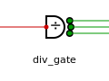

# drawclock 图形库

从左侧形状面板拖出器件，画时钟树示意图。只需导入 **`drawclock.xml`** 一个文件。

## 使用

1. 在 VS Code / Cursor 安装 **Draw.io Integration** 插件（`hediet.vscode-drawio`），在本仓库中打开任意 `.drawio` / `.drawio.svg` 文件。  
2. **文件 → 导入**，选择 `drawclock.xml`。  
3. 在左侧形状库的 **drawclock** 条目中，将器件拖到画布。  
4. **双击**器件改属性；弹出框中 **Placeholders** 必须勾选，再点 **应用**。  
5. 从器件**端口**拖线到其它器件端口。

## 器件

### mux

| 库名 | 输入路数 |
| --- | --- |
| mux2 | 2 |
| mux3 | 3 |
| mux4 | 4 |
| mux5 | 5 |
| mux6 | 6 |

| 属性 | 说明 |
| --- | --- |
| `name` | 实例名 |

### gate

时钟门控。一进一出。

| 属性 | 说明 |
| --- | --- |
| `name` | 实例名 |

### div

固定分频。一进一出。

| 属性 | 说明 |
| --- | --- |
| `name` | 实例名 |

### div_n

可编程分频。外形与 `div` 相同，中心标签为 **div_N**。一进一出。

| 属性 | 说明 |
| --- | --- |
| `name` | 实例名 |

### div_gate

门控分频，占空比非 50%。图案为门控形状加除号。**一进三出**，右侧端口自上而下为 `out0`、`out1`、`out2`。

| 属性 | 说明 |
| --- | --- |
| `name` | 实例名 |

### dto

占空比整形（DTO）。一进一出。

| 属性 | 说明 |
| --- | --- |
| `name` | 实例名 |

### dto_n

可编程 DTO（中心标签 **DTO_N**，波形与 `dto` 镜像）。一进一出。

| 属性 | 说明 |
| --- | --- |
| `name` | 实例名 |

### clk_phase_sel

时钟相位选择，三路输出相位不同。**一进三出**，端口为 `out0`、`out1`、`out2`。

| 属性 | 说明 |
| --- | --- |
| `name` | 实例名 |

### inv_mux

原时钟与取反时钟二选一输出。三角形符号，右侧偏上、偏下两个输出端，下支路带取反圆。**一进二出**，端口为 `out0`、`out1`。

| 属性 | 说明 |
| --- | --- |
| `name` | 实例名 |

### inv

取反。一进一出。

| 属性 | 说明 |
| --- | --- |
| `name` | 实例名 |

### cell（时钟单元）

原灰色 `cell` 已拆为下列四种，均为三角单元、一进一出。

#### occ_clk_cell

蓝色填充。

| 属性 | 说明 |
| --- | --- |
| `name` | 实例名 |

#### gen_cell

红色填充。

| 属性 | 说明 |
| --- | --- |
| `name` | 实例名 |

#### bist_clk_cell

绿色填充。

| 属性 | 说明 |
| --- | --- |
| `name` | 实例名 |

#### occ_bist_clk_cell

绿色填充（略深于 `bist_clk_cell`）。

| 属性 | 说明 |
| --- | --- |
| `name` | 实例名 |

### async

异步域标记：红叉，表示同一源头的多路时钟无固定相位关系。一进一出。

| 属性 | 说明 |
| --- | --- |
| `name` | 实例名 |

### 逻辑门

标准逻辑门符号，浅灰填充；左右各引出一小段水平线，连接点在引线末端。`and`、`nand`、`or`、`nor`、`xor`、`xnor` 为**二进一出**（左侧 `in0`、`in1`，右侧输出）；`buffer` 为**一进一出**。

| 库名 | 预览 |
| --- | --- |
| and |  |
| nand |  |
| or |  |
| nor |  |
| xor |  |
| xnor |  |
| buffer |  |

| 属性 | 说明 |
| --- | --- |
| `name` | 实例名 |

### source

时钟源。仅输出。

| 属性 | 说明 |
| --- | --- |
| `name` | 实例名 |

### pll

PLL，单路输出。一进一出。

| 属性 | 说明 |
| --- | --- |
| `pll_kind` | PLL 类型 |
| `name` | 实例名 |

### pll2

PLL，双路独立输出。**一进二出**，端口为 `out0`、`out1`。

| 属性 | 说明 |
| --- | --- |
| `pll_kind` | PLL 类型 |
| `name` | 实例名 |

### clock

时钟终端（方波 + 频率标注）。仅输入。

| 属性 | 说明 |
| --- | --- |
| `name` | 实例名 |
| `freq` | 频率 |

### wire

连线（可命名、可一分多）。左端接上游，右端接下游。

| 属性 | 说明 |
| --- | --- |
| `name` | 实例名 |
