# 器件库

从左侧形状面板拖出器件，画时钟树示意图。只需导入 **`drawclock.xml`** 一个文件。

## 使用

1. 在 VS Code / Cursor 安装 **Draw.io Integration** 插件（`hediet.vscode-drawio`），在本仓库中打开任意 `.drawio` / `.drawio.svg` 文件。  
2. **文件 → 导入**，选择 `drawclock.xml`。  
3. 在左侧形状库的 **drawclock** 条目中，将器件拖到画布。  
4. **双击**器件改属性；弹出框中 **Placeholders** 必须勾选，再点 **应用**。  
5. 从器件**端口**拖线到其它器件端口。

## 器件

### 选择器

| 库名 | 预览 |
| --- | --- |
| mux2 |  |
| mux3 |  |
| mux4 |  |
| mux5 |  |
| mux6 |  |

| 属性 | 说明 |
| --- | --- |
| `sel` | 控制选择信号名；填则在器件正上方显示竖线与文字，不填则不显示（默认空） |
| `name` | 实例名 |

下方预览图为说明用示例（含 `sel` 示意文字）；拖入库中的器件默认 `sel` 为空，不显示该线段。

### gate

| 属性 | 说明 |
| --- | --- |
| `name` | 实例名 |

### 分频器

| 库名 | 预览 |
| --- | --- |
| div |  |
| div_r | 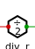 |
| div_n | 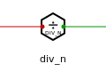 |
| dto | 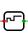 |
| dto_n |  |
| cpu_gate |  |

| 属性 | 说明 |
| --- | --- |
| `name` | 实例名 |
| `ratio` | 分频系数（仅 `div_r`，默认 `2`） |

### clk_phase_sel

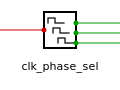

| 属性 | 说明 |
| --- | --- |
| `name` | 实例名 |

### 反相器

| 库名 | 预览 |
| --- | --- |
| inv |  |
| inv_mux |  |

| 属性 | 说明 |
| --- | --- |
| `name` | 实例名 |

### cell

| 库名 | 预览 |
| --- | --- |
| cell | 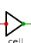 |
| occ_clk_cell |  |
| gen_cell | 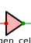 |
| bist_clk_cell | 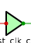 |
| occ_bist_clk_cell |  |

| 属性 | 说明 |
| --- | --- |
| `name` | 实例名 |

### async

| 属性 | 说明 |
| --- | --- |
| `name` | 实例名 |

### 逻辑门

| 库名 | 预览 |
| --- | --- |
| and |  |
| nand | 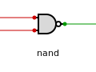 |
| or |  |
| nor |  |
| xor | 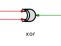 |
| xnor | 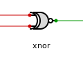 |
| buffer |  |

| 属性 | 说明 |
| --- | --- |
| `name` | 实例名 |

### 时钟源

| 库名 | 预览 |
| --- | --- |
| source |  |
| pad |  |

| 属性 | 说明 |
| --- | --- |
| `name` | 实例名 |

### pll

| 库名 | 预览 |
| --- | --- |
| pll |  |
| pll2 | 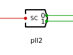 |

| 属性 | 说明 |
| --- | --- |
| `pll_kind` | PLL 类型 |
| `name` | 实例名 |

### clock

| 属性 | 说明 |
| --- | --- |
| `name` | 实例名 |

### from

| 属性 | 说明 |
| --- | --- |
| `name` | 须与某个 `clock` 同名 |
